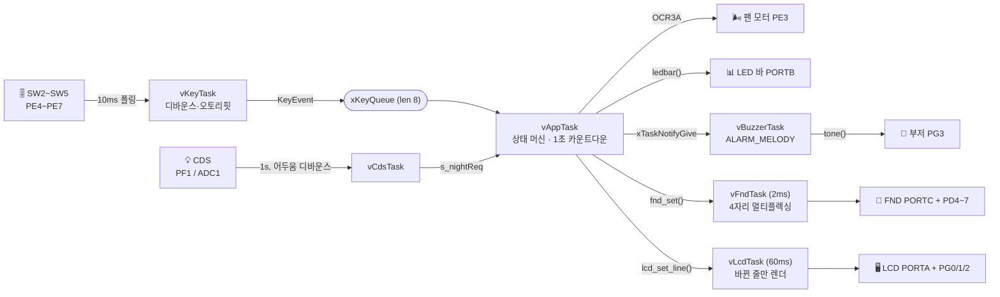
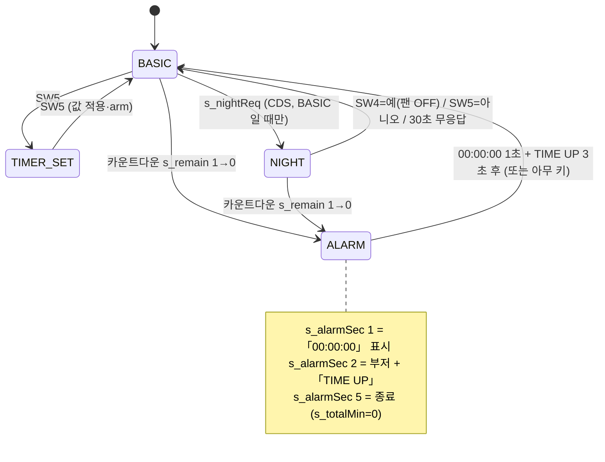

<div align="center">

# 🌀 RTOS Ceiling Fan — ATmega128 실링팬 컨트롤러

**"타이머를 걸어두고 잠들면, 알아서 꺼주는 똑똑한 실링팬"**

FreeRTOS 위에서 도는 ATmega128 실링팬 컨트롤러입니다. 9단 PWM 팬 속도 조절,
초 단위 카운트다운 타이머, 조도센서 기반 **야간 모드** — 6개의 태스크가 각자 맡은 일을 하며 협력합니다.

[](https://www.freertos.org/)
[](https://www.microchip.com/en-us/product/atmega128)
[](https://www.microchip.com/en-us/tools-resources/develop/microchip-studio)
[](https://gcc.gnu.org/wiki/avr-gcc)
[](#-하드웨어--배선)
[-lightgrey?style=flat-square)](rtos_project/Source/)

</div>

---

## 📋 목차

- [개요](#-개요)
- [기능](#-기능)
- [하드웨어 / 배선](#-하드웨어--배선)
- [RTOS 구조](#-rtos-구조)
- [태스크](#-태스크)
- [태스크 간 통신 / 공유 상태](#-태스크-간-통신--공유-상태)
- [모드 상태 머신](#-모드-상태-머신)
- [조작법](#-조작법)
- [화면 표시](#-화면-표시)
- [세부 동작](#-세부-동작)
- [빌드 & 굽기](#-빌드--굽기)
- [폴더 구조](#-폴더-구조)
- [튜닝 포인트](#-튜닝-포인트-boardh)
- [참고 / 한계](#-참고--한계)

---

## 📖 개요

교육용 ATmega128 보드(7세그먼트·캐릭터 LCD·LED 바·스위치·PWM 모터·부저·CDS)를
그대로 활용해, **실링팬 + 취침 타이머 + 조도 기반 자동 종료**를 하나의 RTOS 애플리케이션으로 구현했습니다.

- 🌬️ **9단 PWM 팬** — OC3A(Timer3) 8비트 Fast PWM, 속도에 비례한 duty
- ⏱️ **초 단위 타이머** — 분(0~9999)으로 설정, `HH:MM:SS`로 카운트다운, 0이 되면 팬 정지 + 알람
- 🌙 **야간 모드** — CDS(PF1/ADC1)가 "일정 시간 이상" 어두우면 LCD가 팬을 끌지 물어봄
- 🧩 **RTOS 설계** — FND/LCD/키/부저/앱/CDS 6개 태스크 + 큐·태스크 알림·임계구역

전 주변장치가 **서로 다른 포트**를 써서 공유 버스가 없고, 드라이버가 단순합니다.

---

## ✨ 기능

| 모드 | 설명 |
|---|---|
| **BASIC** | 팬 속도 조절. 타이머가 걸려 있으면 뒤에서 카운트다운. |
| **TIMER_SET** | 타이머 값(분) 편집. 누르고 있으면 증가폭 가속(×1 → ×10 → ×100). |
| **ALARM** | 카운트다운 0 → 팬 정지, LED 바 깜빡, `00:00:00` 1초 표시 후 `*** TIME UP ***` + 멜로디 3초 → `Timer : OFF`. |
| **NIGHT** | CDS가 `CDS_DARK_CONFIRM`초 연속 어두움 확정 → LCD `GOOD NIGHT` / `OFF? SW4=Y SW5=N`. 한 번 발동하면 1시간 동안 재확인 안 함. |

---

## 🔌 하드웨어 / 배선

MCU: **ATmega128** · 외부 **16 MHz** 크리스털 · `CKDIV8` 퓨즈 **해제**

| 신호 | MCU 핀 | 비고 |
|---|---|---|
| LCD 데이터 `D0..D7` | **PORTA** `PA0..PA7` | 8비트 |
| LCD `RS` / `R/W` / `E` | **PG0** / **PG1** / **PG2** | R/W는 항상 0(쓰기 전용) |
| 부저 | **PG3** | active-high, passive(톤 구동). `board.h` `BUZZER_ENABLED` |
| LED 바 | **PORTB** `PB0..PB7` | `PB7` = 막대 바닥, **active-low** |
| FND 세그먼트 `a..dp` | **PORTC** `PC0=a … PC7=dp` | 공통 애노드 → 세그먼트 ON = **LOW** |
| FND 자리선택 | **PD4**(맨 왼쪽) … **PD7**(맨 오른쪽) | 자리 ON = **HIGH** |
| 팬 모터 PWM | **PE3 / OC3A** | Timer3, 8비트 Fast PWM, 분주 /8 (≈7.8 kHz) |
| `SW2..SW5` | **PE4..PE7** | active-low, 내부 풀업 |
| CDS 조도센서 | **PF1 / ADC1** | 아날로그. 어두움 = ADC < `CDS_DARK_LEVEL` |

```
                          ATmega128
   PORTA  PA0..PA7  ─────  LCD  D0..D7
   PORTB  PB0..PB7  ─────  LED 바            (PB7 = 바닥, active-low)
   PORTC  PC0..PC7  ─────  FND 세그먼트 a..dp   (ON = LOW, 공통 애노드)
          PD4 PD5 PD6 PD7  FND 자리 1 2 3 4     (ON = HIGH)
          PE3             ─ 팬 모터 PWM  (OC3A)
          PE4 PE5 PE6 PE7 ─ SW2 SW3 SW4 SW5     (풀업, active-low)
          PF1             ─ CDS 조도센서 (ADC1)
          PG0 PG1 PG2     ─ LCD  RS  R/W  E
          PG3             ─ 부저
```

---

## 🧩 RTOS 구조

- **FreeRTOS Kernel V11.1.0** (`rtos_project/Source/` 에 벤더링)
- **포트**: `Source/portable/GCC/ATMega323` — 클래식 AVR 8비트 포트.
  시스템 틱은 **Timer1** 비교매치 A (`port.c` 의 `TIMER1_COMPA_vect`)
- **힙**: `heap_1` — 모든 객체는 부팅 시 1회 생성, 해제 없음

| `FreeRTOSConfig.h` | 값 |
|---|---|
| `configCPU_CLOCK_HZ` | `16000000` |
| `configTICK_RATE_HZ` | `1000` (1 ms 틱) |
| `configUSE_PREEMPTION` | `1` |
| `configUSE_16_BIT_TICKS` | `1` |
| `configMAX_PRIORITIES` | `6` |
| `configMINIMAL_STACK_SIZE` | `110` |
| `configTOTAL_HEAP_SIZE` | `2800` |

> 16비트 틱은 약 65초마다 오버플로하므로, 카운트다운은 틱 값을 직접 쓰지 않고
> `vAppTask` 가 **틱 델타를 누적**하는 32비트 "남은 초" 카운터를 따로 굴립니다.



---

## 🧵 태스크

| 태스크 | 우선순위 | 주기 | 스택 | 역할 |
|---|:--:|---|---|---|
| `vFndTask`    | **4** | `vTaskDelayUntil` 2 ms | `MIN+40`  | `s_seg[4]` 를 FND 4자리("NLEV")로 고속 멀티플렉싱 (PORTC + PD4~7) |
| `vKeyTask`    | **3** | `vTaskDelayUntil` 10 ms | `MIN+50` | PE4~7 샘플링, 3샘플(30 ms) 디바운스, 눌림 엣지 + 오토리핏 → `xKeyQueue` |
| `vBuzzerTask` | **1** | 태스크 알림 대기 | `MIN+40` | 알람 시 `ALARM_MELODY`(≈1.7 s) 재생. `tone()`(듀티 25 % = 저음량). `BUZZER_ENABLED` 로 on/off |
| `vAppTask`    | **2** | `xQueueReceive` (40 ms 타임아웃) | `MIN+160` | 모드 상태 머신, 모터 duty, 1초 카운트다운, FND/LED/LCD 내용 생성 |
| `vLcdTask`    | **1** | 60 ms, 변경 시에만 기록 | `MIN+90` | HD44780(PORTA + PG0/1/2) 에 바뀐 줄만 렌더 |
| `vCdsTask`    | **1** | `vTaskDelayUntil` 1 s | `MIN+30` | ADC1(PF1) 읽어 "어두운 초" 카운트. `CDS_DARK_CONFIRM` 도달 시 `s_nightReq` 세우고 `CDS_RECHECK_SEC`(1 h) 동안 중단 |
| *Idle*        | 0 | — | `MIN` | — |

---

## 🔗 태스크 간 통신 / 공유 상태

| 객체 | 형태 | 생산자 → 소비자 |
|---|---|---|
| `xKeyQueue` | 큐, `KeyEvent_t{sw,type}`, 길이 8 | `vKeyTask` → `vAppTask` |
| 태스크 알림 | 바이너리 | `vAppTask`(`xTaskNotifyGive`) → `vBuzzerTask`(`ulTaskNotifyTake`) |
| `s_seg[4]` | 배열, `taskENTER_CRITICAL` | `fnd_set()`(vAppTask) → `vFndTask` |
| `s_line[2][16]` + `s_dirty` | 버퍼 + 줄 비트마스크, `taskENTER_CRITICAL` | `lcd_set_line()`(vAppTask) → `vLcdTask` (dirty 줄만 재그림) |
| `s_mode`, `s_armed` | `volatile` (AVR 1바이트 원자적) | `vAppTask` ↔ `vBuzzerTask` |
| `s_nightReq` | `volatile uint8_t` 1회성 플래그 | `vCdsTask` → `vAppTask` (BASIC 일 때만 소비) |
| `s_speed`, `s_totalMin`, `s_remain`, `s_alarmSec` | 일반 | `vAppTask` 전용 |

---

## 🔁 모드 상태 머신



`vCdsTask` 는 상태 머신과 독립적으로 돕니다. 매 1초 PF1을 읽어
`CDS_DARK_CONFIRM`초 연속 어두우면 `s_nightReq` 를 한 번 세우고,
이후 `CDS_RECHECK_SEC`(기본 1시간) 동안 센서를 무시합니다.
`vAppTask` 는 이 요청을 **BASIC 상태일 때만** `NIGHT` 전이로 바꿉니다.

---

## 🎛️ 조작법

| 키 | BASIC | TIMER_SET | NIGHT |
|---|---|---|---|
| **SW2** (PE4) | 팬 OFF (속도 0) | **+10분** | — |
| **SW3** (PE5) | 속도 **−** | **+1분** | — |
| **SW4** (PE6) | 속도 **+** | 리셋(0) | **예** — 팬 끔 |
| **SW5** (PE7) | 타이머 설정 진입 | 값 적용 → BASIC (카운트다운 시작) | **아니오** — 계속 운전 |

- SW2/SW3/SW4는 누르고 있으면 **오토리핏**(≈0.5초 후 초당 ≈8회).
- TIMER_SET에서 계속 누르면 증가폭이 **×1 → ×10(≈1초 후) → ×100(≈2.5초 후)** 로 가속.
- ALARM에서는 **아무 키**나 누르면 즉시 BASIC.

---

## 🖥️ 화면 표시

| 출력 | BASIC / NIGHT | 카운트다운 중 | TIMER_SET | ALARM |
|---|---|---|---|---|
| **FND** (4자리) | `NLEV` — **항상 팬 속도 단계** (예: `3LEV`) | `NLEV` | `NLEV` | `NLEV` |
| **LED 바** (PB0~7) | 속도 1~8 (PB7부터 채움) | 속도 1~8 | 속도 1~8 | 전체 *깜빡* |
| **LCD 1행** | `RTOS Ceiling Fan` (NIGHT: `GOOD NIGHT`) | `RTOS Ceiling Fan` | `RTOS Ceiling Fan` | `RTOS Ceiling Fan` |
| **LCD 2행** | `Timer : OFF` (NIGHT: `OFF? SW4=Y SW5=N`) | `Left HH:MM:SS` | `Set  HH:MM:SS` | `Left 00:00:00`(1초) → `*** TIME UP ***` |

---

## ⚙️ 세부 동작

<details open>
<summary><b>⏱️ 타이머</b></summary>

- 설정값 `s_totalMin` 은 **분**(0~9999). SW5 확정 시 `s_remain = s_totalMin × 60`(초), `s_armed = 1`.
- `vAppTask` 가 틱 델타를 누적해 1초마다 `s_remain--`.
- `s_remain` 이 **진짜 1→0** 으로 내려갈 때만 `MODE_ALARM` 진입 → 임의 발동 없음.
- LCD는 `HH:MM:SS` (`hms()` 헬퍼). 0에 도달하면 `00:00:00` 을 1초 그대로 보여준 뒤 알람.
- 알람이 끝나면 `s_totalMin` 도 0으로 리셋 → 낡은 값이 조용히 재장전되지 않음.

</details>

<details open>
<summary><b>🌙 야간 모드 (CDS)</b></summary>

- `vCdsTask` : `ADMUX = (1<<REFS0) | 1` (AVCC 기준, ADC1), 분주 /128, 단일 변환.
- 매 1초 판정: `CDS_DARK_INVERT` 에 따라 `ADC < CDS_DARK_LEVEL` (또는 반대)면 "어두움".
- **디바운싱**: 어두운 초가 `CDS_DARK_CONFIRM`회 연속되어야 확정.
- 확정 → `s_nightReq = 1`, `cooldown = CDS_RECHECK_SEC` 설정 후 그 시간 동안 재판정 중단.
- NIGHT 진입 시 `SW4=예`(팬 OFF) / `SW5=아니오` / 30초 무응답 시 "아니오". 카운트다운은 NIGHT에서도 계속 진행.

</details>

<details open>
<summary><b>🔔 알람 멜로디</b></summary>

- `ALARM_MELODY[]` = `{주파수Hz, 길이ms}` 표. "봄의 소리 왈츠"(삼성 가전 종료음 원곡) 도입부 상승 프레이즈, 약 1.7초.
- `tone()` 이 `_delay_loop_2` 로 사각파 생성. **듀티 25 %** 로 음량을 낮춤 (50 % → 25 %).
- `BUZZER_ENABLED 0` 이면 `tone()` 이 소리 없이 `vTaskDelay` 로 시간만 흘려보냄(로직 유지).

</details>

---

## 🛠 빌드 & 굽기

1. **Atmel Studio 7** 에서 `rtos_project.atsln` 열기.
2. Device: **ATmega128** / Toolchain: AVR/GNU C
   - 컴파일러 심볼: `GCC_MEGA_AVR`, `F_CPU=16000000UL`
   - 인클루드 경로: `../`, `../Source/include`, `../Source/portable/GCC/ATMega323`
3. 퓨즈: 외부 **16 MHz** 크리스털, **CKDIV8 해제**
4. 프로그래머: **AVRISP mkII**, Interface **ISP**, 125 kHz
5. **Build**(F7) → **Start Without Debugging**(Ctrl+Alt+F5) — ISP는 디버깅 미지원

> 부저 소리를 켜려면 `board.h` 의 `#define BUZZER_ENABLED 1`.

---

## 📁 폴더 구조

```
rtos_project.atsln
rtos_project/
├─ main.c              앱: 상태 머신, 키, 부저 태스크, 모터, 화면 내용
├─ disp.c / disp.h     vFndTask + vLcdTask + FND/LCD 드라이버
├─ board.h             모든 핀 배치 + 클럭 + CDS 설정  ← 배선 바꿀 때 여기만
├─ FreeRTOSConfig.h    커널 설정
├─ rtos_project.cproj  Atmel Studio 프로젝트 파일
├─ Source/             FreeRTOS Kernel V11.1.0 (벤더링)
└─ tools/
   └─ lcd_probe.c      HD44780 단독 점검용 (빌드 미포함)
```

---

## 🎚️ 튜닝 포인트 (`board.h`)

| 매크로 | 기본값 | 의미 |
|---|---|---|
| `LEDBAR_ACTIVE_HIGH` | `0` | LED 바 극성. `PBx=1` 에 켜지면 `1` 로 |
| `FND_SEG_ON_LOW` | `1` | 세그먼트 점등 극성 (공통 애노드) |
| `FND_DIG_ACTIVE_LOW` | `0` | 자리선택 극성 (자리 ON = HIGH) |
| `CDS_DARK_LEVEL` | `300` | 이 ADC 값 미만이면 어두움 |
| `CDS_DARK_INVERT` | `0` | 분압이 반대(어두울수록 큰 값)면 `1` |
| `CDS_DARK_CONFIRM` | `5` | 확정까지 연속 어두운 초 |
| `CDS_RECHECK_SEC` | `3600` | 확정 후 재확인 금지 시간(초) |
| `BUZZER_ENABLED` | `0` | 부저 소리 on/off |

멜로디는 `main.c` 의 `ALARM_MELODY[]` 음표 표에서 수정.

---

## 📌 참고 / 한계

- `heap_1` 이라 태스크·큐는 부팅 시 한 번 만들고 삭제하지 않음.
- 타이머 범위 0~9999분, `HH:MM:SS` 로 표시(시는 99에서 클램프).
- 부저 활성 시 `tone()` 은 우선순위 1에서 busy-wait — 상위 태스크(FND/키/앱)는 preempt 하므로 카운트다운 정확도에 영향 없음.
- FreeRTOS 커널은 MIT 라이선스(`Source/` 참고). 애플리케이션 코드는 자유롭게 사용 가능.
